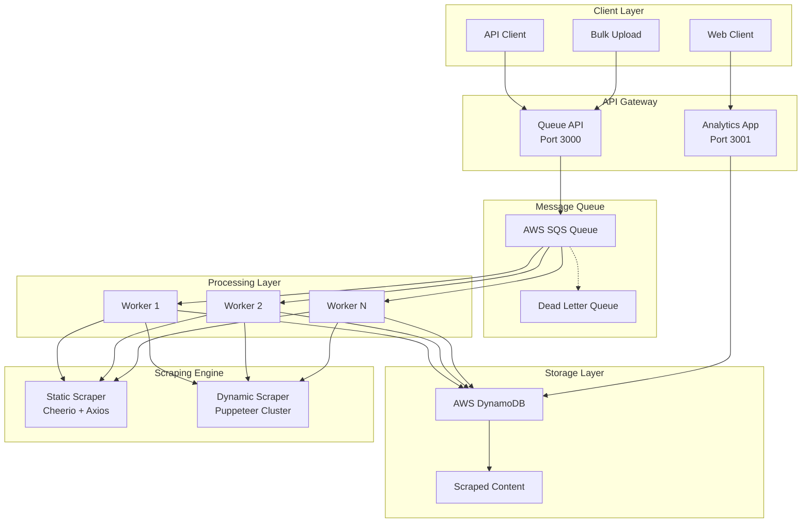
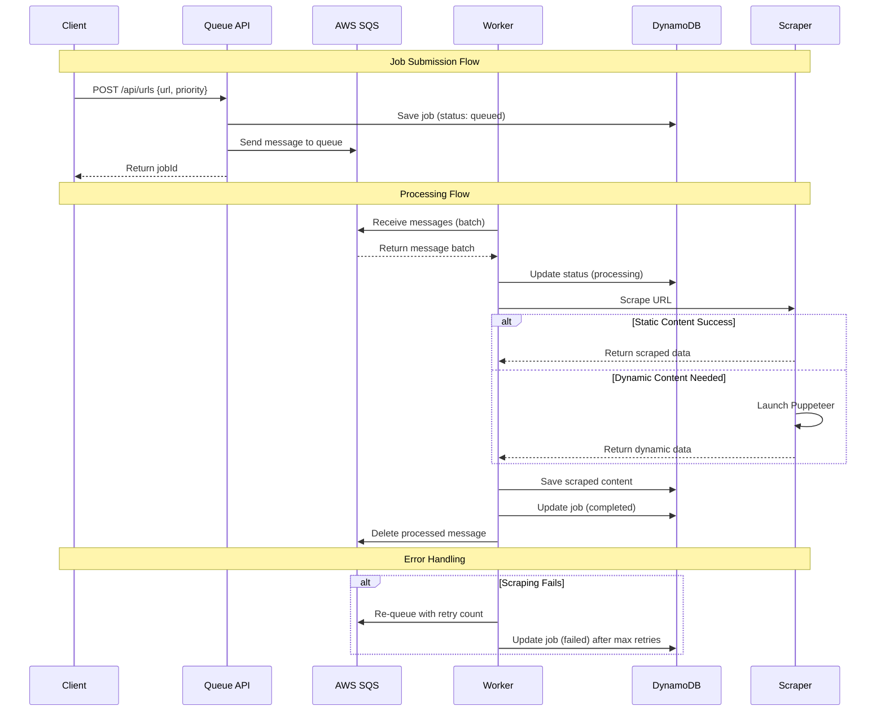

# 🕷️ Async Web Scraper

A high-performance, scalable web scraping system built with **Node.js**, **TypeScript**, **AWS SQS**, **DynamoDB**, and **Docker**. Features async job processing, intelligent scraping strategies, and comprehensive monitoring.


## 📋 Table of Contents

- [🏗️ Architecture Overview](#️-architecture-overview)
- [🎯 Key Features](#-key-features)
- [🚀 Quick Start](#-quick-start)
- [📁 Project Structure](#-project-structure)
- [🔧 Configuration](#-configuration)
- [💡 Usage Examples](#-usage-examples)
- [📊 Monitoring](#-monitoring)
- [🔄 API Reference](#-api-reference)
- [🐳 Docker Deployment](#-docker-deployment)
- [🛠️ Development](#️-development)

## 🏗️ Architecture Overview

### System Flow Diagram



### Message Flow Architecture



## 🎯 Key Features

### ⚡ High Performance
- **Async Processing**: Non-blocking job queue with AWS SQS
- **Intelligent Scraping**: Static-first approach with dynamic fallback
- **Cluster Support**: Multi-worker processing with load balancing
- **Batch Processing**: Process up to 10 messages simultaneously

### 🔧 Smart Scraping Engine
- **Dual Strategy**: Cheerio (fast) → Puppeteer (comprehensive)
- **Auto-Fallback**: Graceful degradation for complex sites
- **Timeout Handling**: Configurable timeouts with partial content recovery
- **User Agent Rotation**: Avoid detection with realistic headers

### 📊 Production Ready
- **Comprehensive Logging**: Winston with daily rotation
- **Health Monitoring**: Built-in health checks and metrics
- **Error Recovery**: Automatic retries with exponential backoff
- **Graceful Shutdown**: Clean worker termination

### 🚀 Scalability
- **Horizontal Scaling**: Deploy multiple worker instances
- **Queue Management**: SQS handles message distribution
- **Database Optimization**: DynamoDB with proper indexing
- **Docker Support**: Container-ready for any environment

## 🚀 Quick Start

### Prerequisites

```bash
# Required
Node.js 18+
Docker & Docker Compose
AWS Account (for SQS & DynamoDB)

# Optional
npm or yarn package manager
```

### 1. Clone & Install

```bash
git clone https://github.com/iakhator/scraper.git
cd scraper

# Install all dependencies
npm install

# Install individual app dependencies
cd apps/queue && npm install
cd ../analytics && npm install
```

### 2. Environment Setup

Create `.env` files for each app:

**`apps/queue/.env`**
```bash
# AWS Configuration
AWS_REGION=us-east-1
AWS_ACCESS_KEY_ID=your_access_key
AWS_SECRET_ACCESS_KEY=your_secret_key

# SQS Configuration
SQS_QUEUE_URL=https://sqs.us-east-1.amazonaws.com/123456789/scraper-queue
SQS_DLQ_URL=https://sqs.us-east-1.amazonaws.com/123456789/scraper-dlq

# DynamoDB Configuration
DYNAMODB_TABLE=scrape_db

# Application Configuration
PORT=3000
NODE_ENV=development
LOG_LEVEL=info

# Scraper Configuration
PAGE_TIMEOUT=15000
QUEUE_BATCH_SIZE=10
MAX_CONCURRENT_PAGES=4
```

**`apps/analytics/.env`**
```bash
# Same AWS configuration as above
AWS_REGION=us-east-1
AWS_ACCESS_KEY_ID=your_access_key
AWS_SECRET_ACCESS_KEY=your_secret_key
DYNAMODB_TABLE=scrape_db

PORT=3001
NODE_ENV=development
```

### 3. AWS Resources Setup

#### Option A: Manual Setup
1. Create SQS Queue: `scraper-queue`
2. Create DLQ: `scraper-dlq` 
3. Create DynamoDB table: `scrape_db`

#### Option B: AWS CLI
```bash
# Create SQS queue
aws sqs create-queue --queue-name scraper-queue

# Create DynamoDB table
aws dynamodb create-table \
    --table-name scrape_db \
    --attribute-definitions \
        AttributeName=PK,AttributeType=S \
        AttributeName=SK,AttributeType=S \
    --key-schema \
        AttributeName=PK,KeyType=HASH \
        AttributeName=SK,KeyType=RANGE \
    --billing-mode PAY_PER_REQUEST
```

### 4. Development Mode

```bash
# Start both apps in development mode
npm run dev

# Or start individually
cd apps/queue && npm run dev
cd apps/analytics && npm run dev

# Start worker separately
cd apps/queue && npm run worker
```

### 5. Test the System

```bash
# Submit a single URL
curl -X POST http://localhost:3000/api/urls \
  -H "Content-Type: application/json" \
  -d '{
    "url": "https://example.com",
    "priority": "high"
  }'

# Submit multiple URLs
curl -X POST http://localhost:3000/api/urls/bulk \
  -H "Content-Type: application/json" \
  -d '{
    "urls": ["https://example.com", "https://github.com"],
    "priority": "medium"
  }'
```

## 📁 Project Structure

```
scraper/
├── 📄 README.md
├── 🐳 docker-compose.yml          # Production setup
├── 🐳 docker-compose.dev.yml      # Development setup
├── 📦 package.json                # Root workspace config
└── apps/
    ├── 📊 analytics/               # Analytics dashboard
    │   ├── 🐳 Dockerfile
    │   ├── ⚙️ nuxt.config.ts
    │   ├── 📦 package.json
    │   └── 📄 app.vue
    └── 🔧 queue/                   # Main processing engine
        ├── 🐳 Dockerfile
        ├── 📦 package.json
        ├── ⚙️ tsconfig.json
        └── src/
            ├── 🚀 index.ts         # API server
            ├── 👷 worker.ts        # Background processor
            ├── 📊 examples/        # Usage examples
            ├── 🔌 routes/          # API endpoints
            │   └── api.ts
            ├── 🔧 services/        # Business logic
            │   ├── queueService.ts
            │   ├── scraperService.ts
            │   └── databaseService.ts
            ├── ☁️ aws-wrapper/     # AWS integrations
            │   ├── config.ts
            │   ├── index.ts
            │   └── clients/
            │       ├── sqs.ts
            │       └── dynamodb.ts
            ├── 🛠️ utils/           # Utilities
            │   ├── logger.ts
            │   ├── validators.ts
            │   └── env.ts
            └── 📝 types/           # TypeScript definitions
                └── index.ts
```

## 🔧 Configuration

### Queue Service Parameters

The `receiveMessages` method accepts various parameters to customize behavior:

```typescript
// Basic usage (uses defaults)
const messages = await queueService.receiveMessages();

// Custom configuration
const messages = await queueService.receiveMessages({
  MaxNumberOfMessages: 10,        // Batch size (1-10)
  WaitTimeSeconds: 20,            // Long polling (0-20)
  VisibilityTimeout: 300,         // Processing time (0-43200)
  MessageAttributeNames: ['All'], // Include custom attributes
  AttributeNames: ['All']         // Include system attributes
});
```

### Environment Variables

| Variable | Description | Default | Required |
|----------|-------------|---------|----------|
| `AWS_REGION` | AWS region | us-east-1 | ✅ |
| `SQS_QUEUE_URL` | SQS queue URL | - | ✅ |
| `DYNAMODB_TABLE` | DynamoDB table | scrape_db | ✅ |
| `PAGE_TIMEOUT` | Puppeteer timeout (ms) | 15000 | ❌ |
| `QUEUE_BATCH_SIZE` | Messages per batch | 10 | ❌ |
| `MAX_CONCURRENT_PAGES` | Puppeteer concurrency | 4 | ❌ |
| `LOG_LEVEL` | Logging level | info | ❌ |

## 💡 Usage Examples

### Submit Single URL

```bash
curl -X POST http://localhost:3000/api/urls \
  -H "Content-Type: application/json" \
  -d '{
    "url": "https://example.com",
    "priority": "high"
  }'

# Response
{
  "jobId": "123e4567-e89b-12d3-a456-426614174000",
  "status": "queued"
}
```

### Submit Bulk URLs

```bash
curl -X POST http://localhost:3000/api/urls/bulk \
  -H "Content-Type: application/json" \
  -d '{
    "urls": [
      "https://example.com",
      "https://github.com",
      "https://stackoverflow.com"
    ],
    "priority": "medium"
  }'

# Response
{
  "jobIds": ["uuid1", "uuid2", "uuid3"],
  "status": "queued",
  "count": 3
}
```

### Worker Processing Examples

```typescript
import { QueueWorker } from './worker';

// Single worker
const worker = new QueueWorker('worker-1');
await worker.start();

// Multiple workers
const manager = new WorkerManager();
await manager.startWorkers(3); // Start 3 workers
```

### Custom Message Processing

```typescript
// High-throughput processing
await worker.processMessagesHighThroughput();

// Priority message processing  
await worker.processHighPriorityMessages();

// Process with custom attributes
await worker.processMessagesWithAttributes();
```

## 📊 Monitoring

### Health Checks

```bash
# API health
curl http://localhost:3000/api/health

# Worker health
const health = worker.getHealthStatus();
console.log(health);
// Output: { worker: 'worker-1', status: 'running', timestamp: '...' }
```

### Logs

```bash
# View logs
tail -f apps/queue/logs/application-$(date +%Y-%m-%d).log

# Log levels: error, warn, info, debug
LOG_LEVEL=debug npm run worker
```

### Queue Metrics

```typescript
// Get queue metrics
const metrics = await worker.getQueueMetrics();
console.log(metrics);
// Output: { messagesAvailable: 5, messagesInFlight: 2, worker: 'worker-1' }
```

## 🔄 API Reference

### Queue API Endpoints

| Method | Endpoint | Description | Parameters |
|--------|----------|-------------|------------|
| POST | `/api/urls` | Submit single URL | `{url, priority}` |
| POST | `/api/urls/bulk` | Submit multiple URLs | `{urls[], priority}` |
| GET | `/api/health` | Health check | - |

### Response Formats

**Success Response:**
```json
{
  "jobId": "uuid",
  "status": "queued"
}
```

**Error Response:**
```json
{
  "error": "Invalid URL: must be a valid URL"
}
```

## 🐳 Docker Deployment

### Development with Docker

```bash
# Start all services
docker-compose -f docker-compose.dev.yml up

# Start specific service
docker-compose -f docker-compose.dev.yml up queue

# View logs
docker-compose -f docker-compose.dev.yml logs -f queue
```

### Production Deployment

```bash
# Build and start
docker-compose up -d

# Scale workers
docker-compose up -d --scale queue=3

# Update and restart
docker-compose build queue
docker-compose up -d queue
```

### Docker Configuration

**Development:** Volume mounts for hot reloading
**Production:** Optimized multi-stage builds

## 🛠️ Development

### Available Scripts

```bash
# Root level
npm run dev              # Start all apps in dev mode

# Queue app (apps/queue/)
npm run dev              # Development server
npm run build            # TypeScript compilation
npm run start            # Production server
npm run worker           # Start worker
npm run worker:prod      # Production worker
npm run examples         # Run usage examples

# Analytics app (apps/analytics/)
npm run dev              # Nuxt development
npm run build            # Build for production
npm run start            # Production server
```

### Adding New Features

1. **New API Endpoint**: Add to `apps/queue/src/routes/api.ts`
2. **New Scraping Strategy**: Extend `ScraperService`  
3. **New Queue Behavior**: Modify `QueueService`
4. **New Worker Pattern**: Extend `QueueWorker`

### Testing

```bash
# Unit tests (when added)
npm test

# Integration testing
npm run examples

# Manual API testing
curl -X POST http://localhost:3000/api/urls \
  -H "Content-Type: application/json" \
  -d '{"url": "https://httpbin.org/json", "priority": "high"}'
```

## 🚨 Troubleshooting

### Common Issues

**AWS Credentials Error:**
```bash
# Verify credentials
aws sts get-caller-identity

# Set credentials
export AWS_ACCESS_KEY_ID=your_key
export AWS_SECRET_ACCESS_KEY=your_secret
```

**Queue Not Processing:**
```bash
# Check queue status
aws sqs get-queue-attributes --queue-url YOUR_QUEUE_URL

# Verify worker is running
docker-compose logs queue
```

**Build Errors:**
```bash
# Clean and rebuild
rm -rf node_modules dist
npm install
npm run build
```

### Performance Tuning

**High Load:**
- Increase `QUEUE_BATCH_SIZE` (max 10)
- Scale workers: `docker-compose up -d --scale queue=5`
- Optimize `PAGE_TIMEOUT` based on target sites

**Memory Issues:**
- Reduce `MAX_CONCURRENT_PAGES`
- Implement worker recycling
- Monitor Puppeteer cluster usage

## 🤝 Contributing

1. Fork the repository
2. Create feature branch: `git checkout -b feature/amazing-feature`
3. Commit changes: `git commit -m 'Add amazing feature'`
4. Push to branch: `git push origin feature/amazing-feature`
5. Open Pull Request

## 📄 License

This project is licensed under the MIT License - see the [LICENSE](LICENSE) file for details.

## 🔗 Links

- **Repository**: [https://github.com/iakhator/scraper](https://github.com/iakhator/scraper)
- **Issues**: [Report bugs or request features](https://github.com/iakhator/scraper/issues)
- **AWS SQS Docs**: [Amazon SQS Documentation](https://docs.aws.amazon.com/sqs/)
- **DynamoDB Docs**: [Amazon DynamoDB Documentation](https://docs.aws.amazon.com/dynamodb/)

---

**Made with ❤️ by [iakhator](https://github.com/iakhator)**
